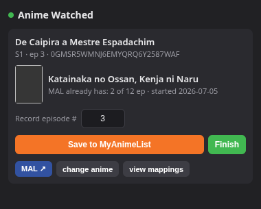
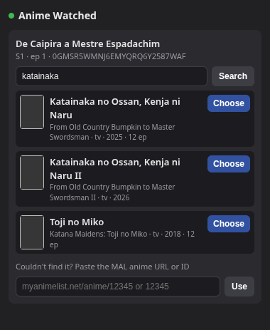
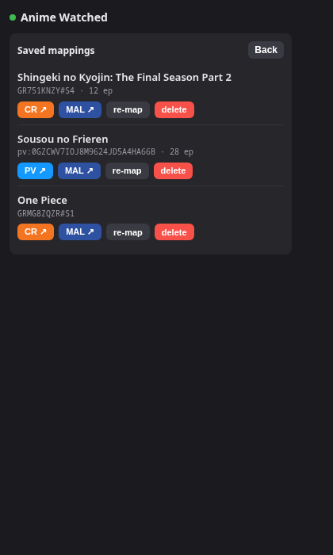

# Anime Watched

*[Leia isso em português](README.pt-BR.md)*

Chrome extension (Manifest V3) that logs, with one click, the episode you just watched on
**Crunchyroll** or **Prime Video** to your anime list — on **MyAnimeList (MAL)** or
**AniList**, whichever you choose as your active provider.

No server, no backend: OAuth, provider API calls, and the mapping table all live inside the
extension (`chrome.storage`).

Interface available in **pt-BR** and **en** (Chrome picks based on the browser's
language).

## Screenshots

| Episode detected → save | Search/pick on the provider | Manage mappings |
|---|---|---|
|  |  |  |

## How it works

Two independent choices come together here: the **source** — Crunchyroll or Prime Video,
detected automatically from the tab you're on — and the **provider** — MAL or AniList,
picked by you — wherever progress actually gets tracked.

1. **Extraction (per source):**
   - **Crunchyroll:** on an episode page (`/watch/...`), reads series, season, and
     episode number from the page's JSON-LD. On the series page (`/series/{id}/...`) —
     no episode open — reads the series ID from the URL and the season from the page's
     own season selector (`docs/cr-extraction.md`).
   - **Prime Video:** with the player open, reads series/season/episode straight from
     the player's DOM overlay. On the detail page (`/detail/{id}`) — no player open —
     reads season and title from the page's metadata; the detail ID itself is already
     season-specific (`docs/pv-extraction.md`).
2. **Provider setup:** pick MAL or AniList in the setup screen — one active at a time,
   switchable anytime from the **⚙** button in the header. Each keeps its own login.
3. Click the extension icon → the popup shows what it detected.
4. **First time for a season:** match it to the right anime on the active provider —
   automatic search by title (AniList's multilingual synonyms handle Prime Video's
   localized titles noticeably better than MAL's plain-title search), or paste the
   provider's URL/ID. If that season is already mapped on the *other* provider, the
   extension tries to resolve it automatically via AniList's `idMal` cross-reference
   before asking you to search again.
5. From there, two options:
   - **Save** — updates your watched-episode count on the provider (**Finish** to close
     out the season).
   - **Plan to watch** — saves the mapping without recording any progress. If the anime
     isn't in any list yet, this also sets its status to "plan to watch" there (0
     episodes); if it's already in a list, only the local mapping is saved — existing
     progress is never touched. Useful for bookmarking something you haven't started yet,
     straight from the anime's own page — without Crunchyroll or Prime Video recording the
     episode as "opened".

Mappings are stored per **season**: on Crunchyroll, `crSeriesId#SseasonNumber` (e.g.,
`GT00371630#S1`); on Prime Video, `pv:<detailId>` (e.g., `pv:0GZCWV7IOJ8M9624JD5A4HA66B`)
— each season already has its own `detail/<ID>` there. Either way this handles the common
case of a season being a separate entry on the provider. Each mapping keeps a target **per
provider**, so switching your active provider never discards a mapping you already had —
worst case, that one season needs mapping again on the new provider (and the cross-ref above
usually avoids even that).

## Installation (unpacked)

1. Open `chrome://extensions`.
2. Turn on **Developer mode** (top-right corner).
3. **Load unpacked** → select this repo's `extension/` folder.
4. The extension shows up in the toolbar. Pin the icon if you'd like.

> The extension ID (and therefore the Redirect URI) stays stable as long as the folder
> doesn't move. If you move the folder, the ID changes and every provider's app needs the
> new Redirect URI.

## Registering the app on your provider

Pick MAL, AniList, or both — the extension only requires credentials for whichever
provider is active.

### MyAnimeList

1. Open the extension popup, pick **MAL** as the provider, and copy the **Redirect URI**
   shown (`https://<extension-id>.chromiumapp.org/`).
2. Go to [myanimelist.net/apiconfig](https://myanimelist.net/apiconfig) → **Create ID**.
3. Fill in:
   - **App Type:** `web` — generates a **Client ID** and **Client Secret** (MAL requires
     the secret when exchanging the token). Choosing `other` makes it a public client with
     no secret.
   - **App Redirect URL:** paste the Redirect URI from step 1
   - **App Description:** minimum 50 characters, no special characters
   - Other required fields (name, homepage, etc.): up to you
4. Save and copy the **Client ID** (and **Client Secret**, if it's a `web` app).
5. In the extension popup: paste the **Client ID** and **Client Secret** → **Save
   credentials** → **Log in to MAL** and authorize.

Login uses OAuth2 with PKCE (`plain` method, a MAL requirement). The Client Secret (when
present) is typed by you and stays only in your machine's `chrome.storage.local` — it's
never embedded in the code or committed.

### AniList

1. Open the extension popup, pick **AniList** as the provider, and copy the **Redirect
   URI** shown.
2. Go to [anilist.co/settings/developer](https://anilist.co/settings/developer) → **Create
   New Application**.
3. Fill in a name and paste the Redirect URI from step 1.
4. Save and copy the **Client ID** (no secret needed — AniList login uses the Implicit
   Grant flow: the extension gets the token directly, with no server-side exchange step).
5. In the extension popup: paste the **Client ID** → **Save credentials** → **Log in to
   AniList** and authorize.

AniList access tokens last about a year and can't be refreshed — when one expires, just log
in again.

## Security notes

`chrome.storage.local` — where auth lives (Client ID/Secret, access/refresh tokens) —
isn't encrypted at rest; it's plain LevelDB on disk. It's isolated from other extensions
and from any web page you visit, but not from anything with local read access to your
Chrome profile (malware, another OS user, etc.). This is a deliberate split: only the
mapping table syncs via `chrome.storage.sync` — it holds no credentials, just
Crunchyroll/Prime Video ↔ provider mapping keys.

If you ever suspect a token leaked, revoke access straight from the provider's own
settings — [myanimelist.net/apiconfig](https://myanimelist.net/apiconfig) for MAL,
[anilist.co/settings/developer](https://anilist.co/settings/developer) for AniList — that
invalidates it immediately, no need to touch the extension.

## Usage

- **Crunchyroll:** open an episode (`/watch/...`) — or just the series page
  (`/series/...`), if you only want to bookmark it — and click the extension icon.
- **Prime Video:** press play on the episode, or just open the anime's detail page
  (`/detail/...`) without playing anything, and click the extension icon.
- **New season:** search/pick the anime on the active provider (or paste the URL/ID), then
  either:
  - adjust the episode number and click **Save** (or **Finish** to close out the season),
    or
  - click **Plan to watch** to bookmark it without recording any progress.
- **Season already mapped:** the popup shows the target and your current progress; adjust
  the number if you want and click **Save**.
- **View mappings:** lists everything mapped so far, with a button that opens the anime's
  page on the source platform (**CR ↗** / **PV ↗**, colored by platform), plus the options
  to open it on the provider (**MAL ↗** / **AniList ↗**), **re-map**, or **delete**.
- **Switch provider:** the **⚙** button in the header (or the setup screen shown before
  you're logged in) opens the provider picker at any time.

### Behavior details

- **Won't regress on its own:** if the provider already shows a higher number than the
  episode you're about to save, the extension warns you and requires a second click before
  reducing it.
- **Episode adjustment:** Crunchyroll's numbering doesn't always match the provider's
  (e.g., a cour with absolute numbering) — that's why the number is editable before saving.
- **`status`:** becomes "completed" once the episode reaches the provider's known total;
  otherwise it stays "watching".
- **Automatic start date:** when saving, if the provider's progress is at **0** (and the
  start date is empty), sets the start date to **today**. The trigger is zeroed progress,
  not episode number — so it works even when Crunchyroll uses sequential numbering that
  differs from the provider's (e.g., `E25` on CR = `S2E1` there).
- **Automatic finish date:** when the season is completed (number ≥ the provider's total,
  with an empty finish date), sets the finish date to **today**.
- **"Finish" button:** explicitly marks completed + finish date = **today**, useful when
  the provider doesn't know the total (simulcast/ongoing season). Adjusts progress to the
  total when it's known.
- **Never overwrites dates:** start and finish dates are only filled in when empty; an
  existing date on the provider is preserved.
- **"Plan to watch" never overwrites progress:** it only sets the "plan to watch" status on
  the provider if the anime isn't in any list yet. If it's already watching, completed,
  etc., clicking it just saves the local mapping — your provider status/progress stays
  untouched.
- **No local progress tracking:** the extension doesn't keep a local copy of "episodes
  watched" — that number always lives on the provider and is read live from there when you
  open the popup for an already-mapped anime. What's stored locally (`chrome.storage`) is
  the Crunchyroll/Prime Video ↔ provider mapping, per provider.
- **Cross-provider resolution:** if a season is already mapped on one provider and you
  switch to the other, the extension tries AniList's `idMal` field to resolve the match
  automatically before falling back to a manual search — works in both directions (MAL↔AniList).

## Structure

```
extension/
  manifest.json
  _locales/
    pt_BR/messages.json  # UI strings (default language)
    en/messages.json     # UI strings (English)
  src/
    background.js  # orchestration: detects the source, reads the tab's episode, routes to the active provider, stores the map
    sources/
      crunchyroll.js  # extracts series/season/episode from Crunchyroll's JSON-LD
      primevideo.js   # extracts series/season/episode from Prime Video's player overlay
    providers/
      index.js    # provider registry (mal, anilist)
      mal.js      # MAL API client (OAuth PKCE, search, save progress)
      anilist.js  # AniList API client (OAuth Implicit Grant, GraphQL search/progress)
      shared.js   # helpers shared between providers (ID parsing, MAL↔AniList cross-reference)
    store.js       # chrome.storage wrapper (config, tokens, mapping table — namespaced per provider)
    popup.html/js  # the interface (state machine), strings via chrome.i18n
  icons/
docs/
  contexto.md                        # context and implementation plan (pt-BR)
  contexto-mapeamento-sem-gravar.md  # design notes for "Plan to watch" (pt-BR)
  contexto-providers.md              # design notes for the provider layer / AniList support (pt-BR)
  cr-extraction.md                   # investigation of Crunchyroll's episode/series pages (extraction source)
  pv-extraction.md                   # investigation of the Prime Video player/detail page (extraction source)
```

## Current scope

Crunchyroll and Prime Video as sources (for Jellyfin, the `jellyfin-ani-sync` plugin
already covers it); MAL and AniList as providers. No automatic end-of-episode detection,
no score/rewatch, no Chrome Web Store publishing — personal use, loaded unpacked.
