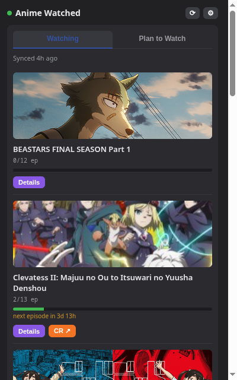
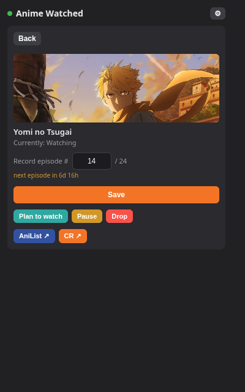
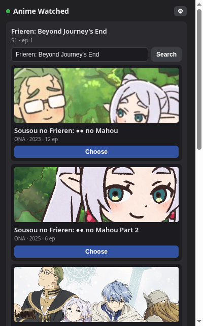

# Anime Watched

*[Leia isso em português](README.pt-BR.md)*

Chrome extension (Manifest V3) that logs, with one click, the episode you just watched on
**Crunchyroll** or **Prime Video** to your real **AniList** lists — no manual mapping, no
separate tracking backend to configure.

> **v1.0.0 is a breaking rewrite: MyAnimeList support is gone**, along with manual mapping
> and the provider-selection UI — AniList is now the only tracking backend. If you need
> MAL sync, use the last release of the previous architecture:
> [v0.5.3](https://github.com/marcelomogami/anime-watched/tree/v0.5.3) (also kept as the
> [`legacy-0.5.3`](https://github.com/marcelomogami/anime-watched/tree/legacy-0.5.3)
> branch).

No server, no backend: OAuth and the AniList API calls all live inside the extension
(`chrome.storage`). Your AniList Watching/Plan to Watch lists *are* the data — the extension
just reads and writes them directly.

Interface available in **pt-BR** and **en** (Chrome picks based on the browser's
language).

## Screenshots

| Your list, at a glance | Anime detail — save, pause, drop | New anime? Just search |
|---|---|---|
|  |  |  |

## How it works

The popup is a small state machine that reacts to whatever tab is active, and always reads
and writes your **real AniList lists** — there's no local mapping table standing in for them.

1. **Extraction (per source):**
   - **Crunchyroll:** on an episode page (`/watch/...`), reads series, season, and
     episode number from the page's JSON-LD. On the series page (`/series/{id}/...`) —
     no episode open — reads the series ID from the URL and the season from the page's
     own season selector.
   - **Prime Video:** with the player open, reads series/season/episode straight from
     the player's DOM overlay. On the detail page (`/detail/{id}`) — no player open —
     reads season and title from the page's metadata; the detail ID itself is already
     season-specific.
2. **Matching against your lists:** the extension keeps a local cache of your whole AniList
   Watching/Plan to Watch/etc. collection (`MediaListCollection`, refreshed automatically
   about once a week or on demand). What's detected on the page is matched against that
   cache — primarily by the streaming link AniList has on file for that anime
   (`externalLinks`), falling back to matching by title when that link is missing or
   outdated (see [Known limitations](#known-limitations)).
3. Click the extension icon → depending on the page and whether a match was found, one of
   four screens shows up:
   - **No match found:** search AniList directly (by title, or paste a URL/ID) and pick the
     right anime. Picking it from an anime/series page adds it as **Plan to Watch** (0
     episodes — that page never has an episode number to record); picking it from an episode
     page saves it straight as **Watching**, with that episode's progress.
   - **No relevant page open:** the **list panel** — tabs for Watching / Plan to Watch, each
     card showing progress, a countdown to the next episode when it's still airing, and a
     source badge that links straight to Crunchyroll/Prime Video.
   - **Anime/series page, already in a list:** the **detail screen** — progress (editable),
     Save, Plan to Watch, Pause, Drop, links to AniList and to the source platform.
   - **Episode page, anime already recognized:** the **quick screen** — the detected episode
     number, ready to save with one click; a **Details** button jumps to the full detail
     screen for anything else (pausing, dropping, etc.).

## Installation (unpacked)

1. Open `chrome://extensions`.
2. Turn on **Developer mode** (top-right corner).
3. **Load unpacked** → select this repo's `extension/` folder.
4. The extension shows up in the toolbar. Pin the icon if you'd like.

> The extension ID (and therefore the Redirect URI) stays stable as long as the folder
> doesn't move. If you move the folder, the ID changes and the AniList app needs the new
> Redirect URI.

## Registering the app on AniList

1. Open the extension popup and copy the **Redirect URI** shown on the login screen.
2. Go to [anilist.co/settings/developer](https://anilist.co/settings/developer) → **Create
   New Application**.
3. Fill in a name and paste the Redirect URI from step 1.
4. Save and copy the **Client ID** (no secret needed — AniList login uses the Implicit
   Grant flow: the extension gets the token directly, with no server-side exchange step).
5. In the extension popup: paste the **Client ID** → **Save credentials** → **Log in to
   AniList** and authorize.

AniList access tokens last about a year and can't be refreshed — when one expires, just log
in again.

## Security notes

`chrome.storage.local` — where auth (Client ID, access token) and the local list cache
live — isn't encrypted at rest; it's plain LevelDB on disk. It's isolated from other
extensions and from any web page you visit, but not from anything with local read access to
your Chrome profile (malware, another OS user, etc.).

If you ever suspect a token leaked, revoke access straight from
[anilist.co/settings/developer](https://anilist.co/settings/developer) — that invalidates it
immediately, no need to touch the extension.

## Usage

- **Crunchyroll:** open an episode (`/watch/...`) — or just the series page
  (`/series/...`), if you only want to bookmark it — and click the extension icon.
- **Prime Video:** press play on the episode, or just open the anime's detail page
  (`/detail/...`) without playing anything, and click the extension icon.
- **New anime:** search/pick it on AniList (or paste the URL/ID); the destination (Plan to
  Watch vs. Watching + progress) depends on whether you came from the anime page or an
  episode page.
- **Already in a list:** the popup shows the right screen automatically — quick save for a
  recognized episode, or the full detail screen from the anime's own page.
- **No relevant page open:** the list panel — Watching / Plan to Watch tabs, with a manual
  **⟳ re-sync** button next to settings if you want to pull in changes made outside the
  extension right away.

### Behavior details

- **Won't regress on its own:** if AniList already shows a higher episode number than the
  one you're about to save, the extension warns you and requires a second click before
  reducing it.
- **Episode adjustment:** Crunchyroll's numbering doesn't always match AniList's (e.g., a
  cour with absolute numbering) — that's why the number is editable before saving.
- **Automatic start date:** when saving, if progress is at **0** (and the start date is
  empty), sets the start date to **today**. The trigger is zeroed progress, not episode
  number — so it works even when Crunchyroll uses sequential numbering that differs from
  AniList's (e.g., `E25` on CR = `S2E1` there).
- **Automatic completion:** the anime completes itself — status becomes `Completed`, finish
  date = **today** — once progress reaches the known episode total. There's no separate
  "Finish" button for the rare case of an unknown total (e.g. an ongoing simulcast) — known
  gap, not ported from the previous architecture.
- **Never overwrites dates:** start and finish dates are only filled in when empty; an
  existing date on AniList is preserved.
- **Leaving "other lists" (Completed/Dropped/Paused/Rewatching) requires confirmation:**
  saving progress or picking Plan to Watch on an anime that's currently in one of those
  shows a warning with its current list first — click again to confirm moving it. Going
  from Plan to Watch to Watching is natural progress and never asks for confirmation.
- **No local progress tracking:** the extension doesn't keep its own copy of "episodes
  watched" — progress always lives on AniList. What's cached locally
  (`chrome.storage.local`) is a read-through copy of your lists, refreshed automatically
  (about once a week, or manually via **⟳**) and patched instantly whenever the extension
  itself saves something.

## Known limitations

- **Crunchyroll matching can miss anime with an outdated link on AniList.** Recognition
  primarily works by matching the series ID in the page's URL against the Crunchyroll link
  AniList has on file (`externalLinks`) for that anime. A real check against one user's list
  found **202 out of 326** Crunchyroll links still using the pre-2018 URL format
  (`crunchyroll.com/<slug>`, no series ID) — those never match by ID. A title-based fallback
  (exact match against AniList's romaji/English title or synonyms) covers most of these, but
  it can still miss if the Crunchyroll page's title doesn't match any of the three exactly
  (different translation/spelling). When that happens, the popup falls back to the search
  screen even though the anime is already in your list — just search and pick it again, it
  won't create a duplicate.

## Structure

```
extension/
  manifest.json
  _locales/
    pt_BR/messages.json  # UI strings (default language)
    en/messages.json     # UI strings (English)
  src/
    background.js  # orchestration: detects the source, reads the tab's episode, resolves which of the 4 states to show, talks to AniList
    sources/
      crunchyroll.js  # extracts series/season/episode from Crunchyroll's JSON-LD
      primevideo.js   # extracts series/season/episode from Prime Video's player overlay
    providers/
      anilist.js  # AniList API client (OAuth Implicit Grant, GraphQL search/list/save)
    store.js       # chrome.storage wrapper (auth, local list cache, CR/PV → AniList resolution)
    popup.html/js  # the interface (state machine), strings via chrome.i18n
  icons/
docs/            # internal design notes (pt-BR), one folder per major version
```

## Current scope

Crunchyroll and Prime Video as sources; AniList as the only tracking backend. No automatic
end-of-episode detection, no score/rewatch, no Chrome Web Store publishing — personal use,
loaded unpacked.

## License

[MIT](LICENSE) — built for personal use, but feel free to use, fork, or borrow from it.
