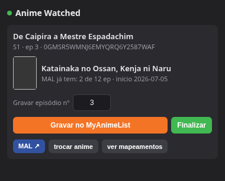
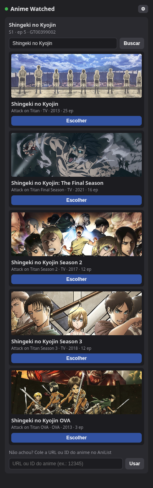
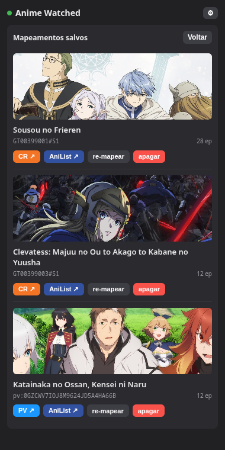

# Anime Watched

*[Read this in English](README.md)*

Extensão de Chrome (Manifest V3) que grava, com um clique, o episódio que você acabou de
ver no **Crunchyroll** ou no **Prime Video** na sua lista de anime — no **MyAnimeList
(MAL)** ou no **AniList**, o que você escolher como provider ativo.

Sem servidor, sem backend: OAuth, chamadas à API do provider e o mapa de mapeamentos vivem
inteiros dentro da extensão (`chrome.storage`).

Interface disponível em **pt-BR** e **en** (o Chrome escolhe pelo idioma do navegador).

## Screenshots

| Episódio detectado → gravar | Buscar/escolher no provider | Gestão de mapeamentos |
|---|---|---|
|  |  |  |

## Como funciona

São duas escolhas independentes que se juntam aqui: a **source** — Crunchyroll ou Prime
Video, detectada automaticamente pela aba em que você está — e o **provider** — MAL ou
AniList, escolhido por você — é onde o progresso de fato fica registrado.

1. **Extração (por source):**
   - **Crunchyroll:** numa página de episódio (`/watch/...`), lê do JSON-LD da página qual
     é a série, a temporada e o número do episódio. Na página da série (`/series/{id}/...`)
     — sem episódio aberto — lê o ID da série na URL e a temporada direto do seletor de
     temporada da própria página (`docs/cr-extraction.md`).
   - **Prime Video:** com o player aberto, lê a série/temporada/episódio direto do overlay
     do player. Na página de detalhe (`/detail/{id}`) — sem o player aberto — lê a
     temporada e o título dos metadados da página; o próprio ID de detalhe já é
     por-temporada (`docs/pv-extraction.md`).
2. **Configurar o provider:** escolha MAL ou AniList na tela de configuração — um fica
   ativo por vez, trocável a qualquer momento pelo botão **⚙** no cabeçalho. Cada um mantém
   o próprio login.
3. Você clica no ícone da extensão → o popup mostra o que foi detectado.
4. **Primeira vez de cada temporada:** você casa a série com o anime certo no provider
   ativo — busca automática por título (os sinônimos multilíngue do AniList lidam bem
   melhor com os títulos traduzidos do Prime Video do que a busca simples do MAL), ou
   colando a URL/ID do provider. Se aquela temporada já estava mapeada no *outro* provider,
   a extensão tenta resolver sozinha via cross-reference `idMal` do AniList antes de pedir
   pra buscar de novo.
5. A partir daí, duas opções:
   - **Gravar** — atualiza o número de episódios assistidos no provider (e **Finalizar**
     pra fechar a temporada).
   - **Para assistir** — salva o mapeamento sem gravar progresso nenhum. Se o anime ainda
     não estiver em nenhuma lista, também marca status "para assistir" lá (0 episódios); se
     já estiver numa lista, só o mapeamento local é salvo — o progresso existente nunca é
     tocado. Útil pra guardar algo que você ainda não começou a assistir, direto da página
     do próprio anime — sem que o Crunchyroll ou o Prime Video registrem o episódio como
     "aberto".

O mapeamento é guardado por **temporada**: no Crunchyroll, `crSeriesId#Stemporada` (ex.:
`GT00371630#S1`); no Prime Video, `pv:<detailId>` (ex.: `pv:0GZCWV7IOJ8M9624JD5A4HA66B`) —
cada temporada já tem o próprio `detail/<ID>` lá. Em ambos os casos resolve o caso comum de
uma temporada ser uma entrada separada no provider. Cada mapeamento guarda um alvo **por
provider**, então trocar o provider ativo nunca descarta um mapeamento que você já tinha —
na pior das hipóteses, só precisa mapear aquela temporada de novo no provider novo (e o
cross-reference acima costuma evitar até isso).

## Instalação (unpacked)

1. Abra `chrome://extensions`.
2. Ative o **Modo do desenvolvedor** (canto superior direito).
3. **Carregar sem compactação** → selecione a pasta `extension/` deste repositório.
4. A extensão aparece na barra. Fixe o ícone se quiser.

> O ID da extensão (e portanto o Redirect URI) é estável enquanto a pasta não mudar de
> lugar. Se mover a pasta, o ID muda e o app de cada provider precisa do novo Redirect URI.

## Registrar o app no provider

Escolha MAL, AniList, ou os dois — a extensão só exige credenciais do provider que estiver
ativo.

### MyAnimeList

1. Abra o popup da extensão, escolha **MAL** como provider, e copie o **Redirect URI**
   mostrado (`https://<extension-id>.chromiumapp.org/`).
2. Vá em [myanimelist.net/apiconfig](https://myanimelist.net/apiconfig) →
   **Create ID**.
3. Preencha:
   - **App Type:** `web` — gera **Client ID** e **Client Secret** (o MAL exige o secret
     na troca do token). Se escolher `other`, é cliente público e não há secret.
   - **App Redirect URL:** cole o Redirect URI do passo 1
   - **App Description:** mínimo de 50 caracteres, sem caracteres especiais
   - Demais campos obrigatórios (nome, homepage, etc.): à vontade
4. Salve e copie o **Client ID** (e o **Client Secret**, se for app `web`).
5. No popup da extensão: cole o **Client ID** e o **Client Secret** → **Salvar
   credenciais** → **Login no MAL** e autorize.

O login usa OAuth2 com PKCE (método `plain`, exigência do MAL). O Client Secret (quando
existe) é digitado por você e fica apenas no `chrome.storage.local` da sua máquina — nunca
é embutido no código nem versionado.

### AniList

1. Abra o popup da extensão, escolha **AniList** como provider, e copie o **Redirect URI**
   mostrado.
2. Vá em [anilist.co/settings/developer](https://anilist.co/settings/developer) →
   **Create New Application**.
3. Preencha um nome e cole o Redirect URI do passo 1.
4. Salve e copie o **Client ID** (sem secret — o login do AniList usa o fluxo Implicit
   Grant: a extensão recebe o token direto, sem etapa de troca no servidor).
5. No popup da extensão: cole o **Client ID** → **Salvar credenciais** → **Login no
   AniList** e autorize.

Os tokens de acesso do AniList duram cerca de um ano e não têm renovação automática —
quando expirar, é só logar de novo.

## Notas de segurança

O `chrome.storage.local` — onde a autenticação fica (Client ID/Secret, tokens de
acesso/refresh) — não é criptografado em disco; é LevelDB puro. Fica isolado de outras
extensões e de qualquer site que você visite, mas não de qualquer coisa com acesso de
leitura local ao seu perfil do Chrome (malware, outro usuário do sistema, etc.). É uma
separação deliberada: só o mapa de mapeamentos sincroniza via `chrome.storage.sync` — ele
não guarda nenhuma credencial, só as chaves de vínculo Crunchyroll/Prime Video ↔ provider.

Se em algum momento suspeitar que um token vazou, revogue o acesso direto nas
configurações do próprio provider —
[myanimelist.net/apiconfig](https://myanimelist.net/apiconfig) pro MAL,
[anilist.co/settings/developer](https://anilist.co/settings/developer) pro AniList — isso
invalida na hora, sem precisar mexer na extensão.

## Uso

- **Crunchyroll:** abra um episódio (`/watch/...`) — ou só a página da série
  (`/series/...`), se você só quiser guardar pra depois — e clique no ícone da extensão.
- **Prime Video:** dê play no episódio, ou só abra a página de detalhe do anime
  (`/detail/...`) sem tocar nada, e clique no ícone da extensão.
- **Temporada nova:** busque/escolha o anime no provider ativo (ou cole a URL/ID) e depois:
  - ajuste o nº do episódio e clique em **Gravar** (ou **Finalizar** pra fechar a
    temporada), ou
  - clique em **Para assistir** pra guardar sem gravar progresso.
- **Temporada já mapeada:** o popup mostra o alvo e seu progresso atual; ajuste o nº se
  quiser e clique em **Gravar**.
- **Ver mapeamentos:** lista tudo que já foi mapeado, com um botão que abre a página do
  anime na plataforma de origem (**CR ↗** / **PV ↗**, colorido por plataforma), além das
  opções de abrir no provider (**MAL ↗** / **AniList ↗**), **re-mapear** ou **apagar**.
- **Trocar de provider:** o botão **⚙** no cabeçalho (ou a tela de configuração mostrada
  antes de você logar) abre o seletor de provider a qualquer momento.

### Detalhes de comportamento

- **Não retrocede sozinho:** se o provider já marca um número maior que o episódio que você
  vai gravar, a extensão avisa e pede um segundo clique antes de reduzir.
- **Ajuste de episódio:** a numeração do Crunchyroll nem sempre bate com a do provider
  (ex.: cour com numeração absoluta) — por isso o número é editável antes de gravar.
- **`status`:** vira "concluído" quando o episódio atinge o total de episódios conhecido no
  provider; senão fica "assistindo".
- **Data de início automática:** ao gravar, se o progresso no provider estiver em **0** (e
  o start date vazio), define o início como **hoje**. A trava é o progresso zerado, não o
  número do episódio — assim funciona mesmo quando o Crunchyroll usa numeração sequencial
  diferente da do provider (ex.: `E25` no CR = `S2E1` lá).
- **Data de fim automática:** ao completar a temporada (nº ≥ total do provider, com finish
  date vazio), define o fim como **hoje**.
- **Botão "Finalizar":** marca concluído + fim = **hoje** explicitamente, útil quando o
  provider não conhece o total (simulcast/temporada em andamento). Ajusta o progresso para
  o total quando conhecido.
- **Nunca sobrescreve datas:** início e fim só são preenchidos quando estão vazios; uma
  data já existente no provider é preservada.
- **"Para assistir" nunca sobrescreve progresso:** só define status "para assistir" no
  provider se o anime ainda não estiver em nenhuma lista. Se já estiver assistindo,
  concluído etc., clicar nele só grava o mapeamento local — seu status/progresso no
  provider fica intocado.
- **Sem progresso local:** a extensão não guarda cópia local de "episódios assistidos" —
  esse número sempre vive no provider e é lido ao vivo de lá quando você abre o popup pra
  um anime já mapeado. O que fica salvo localmente (`chrome.storage`) é o vínculo
  Crunchyroll/Prime Video ↔ provider, por provider.
- **Resolução entre providers:** se uma temporada já está mapeada num provider e você troca
  pro outro, a extensão tenta o campo `idMal` do AniList pra resolver o vínculo sozinha
  antes de cair na busca manual — funciona nos dois sentidos (MAL↔AniList).

## Estrutura

```
extension/
  manifest.json
  _locales/
    pt_BR/messages.json  # strings da interface (idioma padrão)
    en/messages.json     # strings da interface (inglês)
  src/
    background.js  # orquestra: detecta a source, lê o episódio da aba, roteia pro provider ativo, guarda o mapa
    sources/
      crunchyroll.js  # extrai série/temporada/episódio do JSON-LD do Crunchyroll
      primevideo.js   # extrai série/temporada/episódio do overlay do player do Prime Video
    providers/
      index.js    # registro dos providers (mal, anilist)
      mal.js      # cliente da API do MAL (OAuth PKCE, busca, gravar progresso)
      anilist.js  # cliente da API do AniList (OAuth Implicit Grant, busca/progresso via GraphQL)
      shared.js   # helpers reaproveitados entre providers (parse de ID, cross-reference MAL↔AniList)
    store.js       # wrapper de chrome.storage (config, tokens, mapa de mapeamentos — namespaced por provider)
    popup.html/js  # a interface (máquina de estados), com strings via chrome.i18n
  icons/
docs/
  contexto.md                        # contexto e plano de implementação
  contexto-mapeamento-sem-gravar.md  # plano da feature "Para assistir"
  contexto-providers.md              # plano da camada de providers / suporte a AniList
  cr-extraction.md                   # investigação das páginas de episódio/série do Crunchyroll (fonte da extração)
  pv-extraction.md                   # investigação do player/página de detalhe do Prime Video (fonte da extração)
```

## Escopo atual

Crunchyroll e Prime Video como sources (no Jellyfin, o plugin `jellyfin-ani-sync` já
cobre); MAL e AniList como providers. Sem detecção automática de fim de episódio, sem
score/rewatch, sem publicação na Chrome Web Store — uso pessoal, carregado unpacked.
